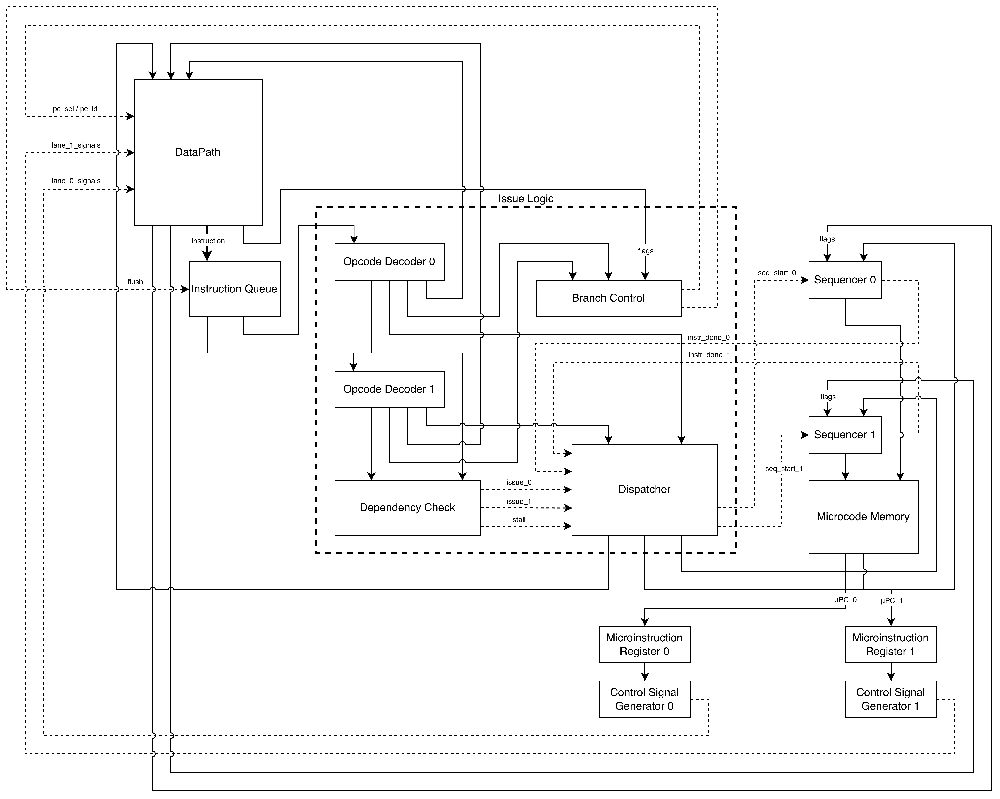

# Half68k. Транслятор + Модель процессора #

---

### Отчет по лабораторной работе №4

- ФИО: Сафин Максим Владиславович
- Группа: P3222
- Вариант `asm | cisc | harv | mc | tick | binary | stream | mem | pstr | prob1 | superscalar`

---

## Язык программирования Half68k (CISC ASM)
Синтаксис языка представляет собой ассемблер, адаптированный под CISC-архитектуру. Код разделяется на секции данных и текста.

Форма Бэкуса-Наура (БНФ):
```
<program>            ::= { <section> }*

<section>            ::= <section_directive> { <line> }*
<section_directive>  ::= ".data" | ".code"

<line>               ::= [ <label> ] [ <statement> ] [ <comment> ] NEWLINE
<label>              ::= IDENT ":"

<statement>          ::= <instruction>
                       | <data_directive>
                       | <org_directive>

<instruction>        ::= <mnemonic> [ "." <size> ] <operand_list>
<mnemonic>           ::= "mv"   | "add" | "sub" | "cmp" | "mul" | "div"
                       | "and"  | "or"  | "xor"
                       | "clr"  | "neg" | "not"
                       | "asl"  | "asr" | "lsl" | "lsr"
                       | "jmp"  | "jsr" | "rts" | "die"
                       | "bcc"  | "bcs" | "beq" | "bne" | "bmi" | "bpl"
                       | "bvs"  | "bvc" | "blt" | "ble" | "bgt" | "bge"
<size>               ::= "b" | "l"

<operand_list>       ::= <operand> { "," <operand> }*
<operand>            ::= <reg>
                       | "#" <expression>
                       | "(" <expression> ")"
                       | "(" <reg> ")"
                       | "(" <reg> ")+"
                       | "-(" <reg> ")"
                       | <expression> "(" <reg> ")"

<reg>                ::= "R0" | "R1" | "R2" | "R3" | "R4" | "R5" | "R6" | "SP"

<data_directive>     ::= "db" <byte_list>
                       | "dw" <word_list>
                       | "pstr" <string>
<byte_list>          ::= <expression> { "," <expression> }*
<word_list>          ::= <expression> { "," <expression> }*
<string>             ::= '"' { CHAR }* '"'

<org_directive>      ::= ".org" <expression>

<expression>         ::= <term> { ("+" | "-") <term> }*
<term>               ::= <number> | IDENT
<number>             ::= DECIMAL | HEX | BINARY
<comment>            ::= ";" { CHAR }* NEWLINE
```

**Особенности семантики:**

- Секции и управление размещением
  - Исходный код делится на секции `.data` (данные) и `.code` (код).
  - Директива `.org` позволяет явно указать адрес начала следующей инструкции или данных.

- Суффиксы размера операций
  - Все мнемоники, работающие с данными, требуют обязательного суффикса: .b (8-битный байт) или .l (32-битное слово).

- Единый регистровый файл
  - Доступны 8 общих регистров: R0, R1, R2, R3, R4, R5, R6, SP.
  - SP является псевдонимом аппаратного указателя стека и семантически выделен, но кодируется как обычный регистр.

- Развитые режимы адресации (CISC-характер)
  - Непосредственный: #число
  - Прямой регистровый: Rn
  - Косвенный через регистр: (Rn)
  - Косвенный с постинкрементом: (Rn)+
  - Косвенный с предекрементом: -(Rn)
  - Косвенный со смещением: d(Rn), где d – знаковое 16-битное смещение
  - Абсолютная адресация: (адрес) (например, (0xFF) или (метка))

- Директивы данных
  - db – размещает байтовые значения (каждое в отдельном слове).
  - dw – размещает 32-битные слова.
  - pstr – создаёт Pascal-строку: первое слово – длина (целое), следующие слова – коды символов.

- Выражения и литералы
  - Операнды могут содержать: числа (десятичные, 0x-шестнадцатеричные, 0b-двоичные), метки.
  - Константы, определённые через %define, также допустимы в выражениях.

- Комментарии
  - Начинаются с ';' и действуют до конца строки.

- Препроцессор
  - %define NAME value – текстовая подстановка.
  - %macro NAME args... … %endmacro – многострочные макросы.
  - %ifdef NAME / %ifndef NAME … %else … %endif – условная компиляция.

---

## Организация памяти

### Архитектура памяти (Гарвардская)

Процессор Half68k использует **Гарвардскую архитектуру** — память команд и память данных разделены,
имеют независимые адресные пространства и шины.

- Размер машинного слова: **32 бита**.
- Адресация: линейная, 32-битная, но фактический объём памяти ограничен моделью.
- Чтение/запись данных и выборка инструкций не конфликтуют.

### Регистры

- **Регистры общего назначения**: R0, R1, R2, R3, R4, R5, R6 (32 бита).
  Используются как для данных, так и для адресов.
- **Указатель стека (SP)**: выделенный 32-битный регистр (кодируется как R7).
  Участвует в адресации с режимами `(SP)`, `(SP)+`, `-(SP)`, `d(SP)`.
- **Регистр флагов (SR)**: хранит флаги N (знак), Z (ноль), C (перенос), V (переполнение).
  Не входит в регистровый файл, изменяется арифметико-логическими инструкциями и `cmp`.
  Используется только условными переходами.

Стек растёт **вниз** (от старших адресов к младшим). SP всегда указывает на **последний
занятый элемент** (full descending). При вызове `jsr` на стеке сохраняется адрес возврата,
при `rts` — восстанавливается.

### Память команд (Instruction Memory)

Память команд доступна **только для чтения** во время исполнения. Содержит инструкции,
загружаемые из бинарного файла. Начальный адрес программы задаётся директивой `.org`
в секции `.code`. Векторов прерываний нет (ввод-вывод реализован через поток, без прерываний).

### Память данных (Data Memory)

Память данных используется для хранения:

- **Статических данных** — константы, переменные, строки (секция `.data`).
- **Стека** — растёт вниз от начального значения SP.
- **Отображённых портов ввода-вывода (memory-mapped I/O)**.

Модель памяти данных (пример раскладки):

```
Data Memory
+---------------------------+ 0x00000000
| Статические данные        |
| (переменные, константы,   |
| строки pstr)              |
+---------------------------+ 0x00010000 (пример)
| Стек (растёт вниз)        |
|                           | <- SP (начальное значение)
+---------------------------+ 0xFFFFFEF0
| Не используется |
+---------------------------+ 0xFFFFFF00
| IN_PORT (чтение символа)  | 0xFFFFFF00
| OUT_PORT (запись символа) | 0xFFFFFF04
+---------------------------+
```

### Размещение литералов, констант и переменных

- **Литералы (непосредственные значения)** — встраиваются в код инструкции (`#число`).
  Если литерал не помещается в 16 бит (для режимов со смещением), он сохраняется в памяти
  данных как константа, а транслятор генерирует обращение через абсолютную адресацию.
- **Строки (pstr)** — размещаются в `.data` с помощью директивы `pstr`. Формат:
    + первое слово: длина строки (целое без знака);
    + последующие слова: символы (ASCII-код в младшем байте, старшие байты нулевые).
      Адрес строки равен адресу первого слова (длины).
- **Числовые константы и переменные** — определяются метками в `.data` и резервируют
  память через `dw`, `db`. Каждое значение занимает одно 32-битное слово.

### Ввод-вывод (stream, memory-mapped)

- **Потоковый ввод-вывод (stream)**: перед запуском модели все входные данные помещаются
  в буфер. При чтении из порта `IN_PORT` модель извлекает очередной байт; если буфер пуст —
  моделирование останавливается. При записи в `OUT_PORT` байт добавляется в выходной буфер.
- Порты отображены на память: `IN_PORT` (0xFFFFFF00), `OUT_PORT` (0xFFFFFF04).
  Доступ к ним осуществляется обычными инструкциями `mv.b (IN_PORT), Rd` и `mv.b Rs, (OUT_PORT)`.

### Отображение процедур и стека

- Процедуры (подпрограммы) реализуются с помощью `jsr`/`rts`. Адрес возврата сохраняется
  на стеке. Локальные переменные могут размещаться на стеке с помощью `-(SP)` или
  смещения относительно SP, но стековый фрейм управляется программистом.
- `SP` инициализируется значением `DATA_MEM_SIZE * 4 - 4`.

## Система команд

### Формат инструкций

Все инструкции переменной длины (CISC). Каждая начинается с **32-битного слова опкода**, за которым следуют 0–3 слова расширения (немедленные значения, смещения, абсолютные адреса).

**Слово опкода** (32 бита):

| Биты      | Назначение                                                                       |
|-----------|----------------------------------------------------------------------------------|
| [31:26]   | Код операции (6 бит)                                                             |
| [25]      | Размер: 0 = `.l` (32 бита), 1 = `.b` (8 бит)                                     |
| [24:20]   | Режим и регистр первого операнда (src)                                           |
| [19:15]   | Режим и регистр второго операнда (dst)                                           |
| [14:0]    | Дополнительные признаки (для сдвигов — код направления, для переходов — условие) |

**Кодирование поля операнда (5 бит):**

| Биты [4:3] | Режим              | Биты [2:0]               | Пояснение                                                                       |
|------------|--------------------|--------------------------|---------------------------------------------------------------------------------|
| 00         | Непосредственный   | 000 (игнорируется)       | за опкодом следует 32-битное значение                                           |
| 01         | Прямой регистровый | номер регистра (0–7)     | R0–R6, SP (код 7)                                                               |
| 10         | Косвенный          | номер регистра           | `(Rn)`                                                                          |
| 11         | Специальный        | 000 – `(Rn)+`            | за опкодом слово с номером регистра в битах [19:16] (остальное 0)               |
| 11         | Специальный        | 001 – `-(Rn)`            | за опкодом слово с номером регистра в битах [19:16] (остальное 0)               |
| 11         | Специальный        | 010 – `d(Rn)`            | за опкодом слово c номером регистра в битах [19:16], знаковое смещение в [15:0] |
| 11         | Специальный        | 011 – `(abs)`            | за опкодом 32‑битный абсолютный адрес                                           |

### Набор инструкций и такты

| Мнемоника | Код [31:26] | Формат                                     | Такты | Флаги               | Описание                                            |
|-----------|-------------|--------------------------------------------|-------|---------------------|-----------------------------------------------------|
| `mv`      | 000001      | mv.size src,dst                            | 2–4   | N,Z                 | dst ← src                                           |
| `add`     | 000010      | add.size src,dst                           | 2–4   | N,Z,C,V             | dst ← dst + src                                     |
| `sub`     | 000011      | sub.size src,dst                           | 2–4   | N,Z,C,V             | dst ← dst - src                                     |
| `cmp`     | 000100      | cmp.size src,dst                           | 2–4   | N,Z,C,V (dst-src)   | сравнить, флаги                                     |
| `mul`     | 000101      | mul.size src,dst                           | 4–6   | N,Z                 | dst ← dst * src (младшее слово)                     |
| `div`     | 000110      | div.size src,dst                           | 6–8   | N,Z                 | dst ← dst / src (целое)                             |
| `and`     | 000111      | and.size src,dst                           | 2–4   | N,Z                 | dst ← dst & src                                     |
| `or`      | 001000      | or.size src,dst                            | 2–4   | N,Z                 | dst ← dst \| src                                    |
| `xor`     | 001001      | xor.size src,dst                           | 2–4   | N,Z                 | dst ← dst ^ src                                     |
| `clr`     | 001010      | clr.size dst                               | 2     | N(0),Z(1),C(0),V(0) | dst ← 0                                             |
| `neg`     | 001011      | neg.size dst                               | 2     | N,Z,C,V             | dst ← -dst                                          |
| `not`     | 001100      | not.size dst                               | 2     | N,Z                 | dst ← ~dst                                          |
| `asl`     | 001101      | asl.size src,dst (src – счётчик или #imm)  | 3–5   | N,Z,C               | dst ← dst << src (арифметический)                   |
| `asr`     | 001110      | asr.size src,dst                           | 3–5   | N,Z,C               | dst ← dst >> src (арифметический)                   |
| `lsl`     | 001111      | lsl.size src,dst                           | 3–5   | N,Z,C               | dst ← dst << src (логический)                       |
| `lsr`     | 010000      | lsr.size src,dst                           | 3–5   | N,Z,C               | dst ← dst >> src (логический)                       |
| `jmp`     | 010001      | jmp addr                                   | 2     | –                   | PC ← addr (абсолютный адрес)                        |
| `jsr`     | 010010      | jsr addr                                   | 3     | –                   | SP←SP-4, [SP]←PC+4, PC←addr                         |
| `rts`     | 010011      | rts                                        | 3     | –                   | PC←[SP], SP←SP+4                                    |
| `die`     | 010100      | die                                        | 1     | –                   | остановка программы                                 |
| `bcc`     | 010101      | bcc addr                                   | 2/3   | –                   | переход, если C=0 (если переход — 3 такта, иначе 2) |
| `bcs`     | 010110      | bcs addr                                   | 2/3   | –                   | если C=1                                            |
| `beq`     | 010111      | beq addr                                   | 2/3   | –                   | если Z=1                                            |
| `bne`     | 011000      | bne addr                                   | 2/3   | –                   | если Z=0                                            |
| `bmi`     | 011001      | bmi addr                                   | 2/3   | –                   | если N=1                                            |
| `bpl`     | 011010      | bpl addr                                   | 2/3   | –                   | если N=0                                            |
| `bvs`     | 011011      | bvs addr                                   | 2/3   | –                   | если V=1                                            |
| `bvc`     | 011100      | bvc addr                                   | 2/3   | –                   | если V=0                                            |
| `blt`     | 011101      | blt addr                                   | 2/3   | –                   | если N≠V                                            |
| `ble`     | 011110      | ble addr                                   | 2/3   | –                   | если Z=1 или N≠V                                    |
| `bgt`     | 011111      | bgt addr                                   | 2/3   | –                   | если Z=0 и N=V                                      |
| `bge`     | 100000      | bge addr                                   | 2/3   | –                   | если N=V                                            |

**Примечание:** такты указаны для простых режимов (регистр-регистр). Для инструкций с памятью добавляется 1-2 такта на доступ. Точная длительность будет зафиксирована в модели микрокода.

### Кодирование инструкций

- **Арифметические/логические**: опкод в [31:26], размер в [25], src/dst в [24:15]. Если src или dst используют специальный режим, требующий расширения, за опкодом следуют 1–2 слова.
- **Переходы и управление**: опкод в [31:26] (или расширенный код условия). Для `jmp`, `jsr` и условных переходов за опкодом всегда следует 32-битный абсолютный адрес перехода. `rts` и `die` не имеют операндов, src/dst игнорируются.
- **Сдвиги**: опкод задаёт направление и тип, src может быть непосредственным счётчиком `#imm` или регистром. Используется стандартный формат с двумя операндами.

---

## Транслятор

Консольное приложение на Python, преобразующее исходный код на ассемблере Half68k в машинный код и отладочный дамп.

### Интерфейс командной строки

`python3 translator.py <input.s> <output.bin>`

**Входные данные:**
- `<input.s>` — текстовый файл с исходным кодом на Half68k (расширение `.s`).
- `<output.bin>` — имя выходного бинарного файла.

**Выходные данные:**
- `<output.bin>` — бинарный файл машинного кода в формате:
    - 4 байта (little-endian) — количество слов данных.
    - Далее 32-битные слова секции данных.
    - Затем 32-битные слова секции кода (инструкции в порядке адресов).
- `<output.log>` — текстовый отладочный дамп в формате:
    ```
    DATA <адрес> - <HEX-код>
    CODE <адрес> - <HEX-код> - <мнемоника>
    ```
**Пример запуска:**
```bash
python3 translator.py tests/hello/hello.s tests/hello/hello.bin
```

### Принципы работы

Транслятор состоит из трёх последовательных модулей: препроцессор, парсер (двухпроходный), генератор бинарного кода.

#### 1. Препроцессор (preprocessor.py)
Обрабатывает исходный текст до начала компиляции:
- `%define NAME value` — текстовая подстановка с учётом границ слов. Все вхождения NAME в коде заменяются на value.
- `%macro NAME args... … %endmacro` — многострочные макросы. При вызове макроса по имени фактические аргументы подставляются в тело макроса вместо формальных. Вложенные макросы не поддерживаются.
- `%ifdef NAME / %ifndef NAME … %else … %endif` — условная компиляция. Проверяется наличие имени в таблице %define. Поддерживается вложенность.

Результат препроцессора — «чистый» ассемблерный код без препроцессорных директив.

#### 2. Парсер (parser.py)
Реализует двухпроходную трансляцию.

**Первый проход** (сбор меток и вычисление адресов):
- Определяется текущая секция (.data или .code) и независимые счётчики адресов для каждой.
- Для каждой инструкции вычисляется её размер в словах на основе режимов адресации операндов (CISC-логика).
- Метки в секции данных привязываются к адресам данных; метки в секции кода — к адресам кода.
- Данные (db, dw, pstr) сохраняются в промежуточный список DataItem для последующей генерации.
- Операнды инструкций, содержащие идентификаторы (метки, константы), сохраняются как строки для разрешения во втором проходе.

**Второй проход** (разрешение меток и генерация кода):
- Для каждой инструкции все строковые имена меток заменяются числовыми адресами из таблиц символов (data_symbols, symbols).
- Вызывается функция _generate_instruction_words, которая кодирует инструкцию в одно или несколько 32-битных слов согласно системе команд:
  - Управляющие инструкции (переходы) — опкод + абсолютный адрес.
  - Безадресные (rts, die) — только опкод.
  - Остальные — опкод с полями режимов src/dst и необходимыми расширениями (непосредственное значение, смещение, абсолютный адрес, номер регистра для postinc/predec).
- Из сохранённых DataItem генерируются слова секции данных (с разрешением меток).

#### 3. Генератор бинарного файла (translator.py)
Скомпонованные списки слов данных и кода записываются в бинарный файл: сначала заголовок (количество слов данных), затем данные, затем код. Параллельно формируется текстовый дамп с адресами и HEX-кодами.

---

## Модель процессора
Процессор реализует **суперскалярную микропрограммную CISC-архитектуру** с раздельными адресными пространствами команд и данных (Гарвардская архитектура). Исполнительный тракт разделен на два параллельных независимых канала — **Lane 0** и **Lane 1**, функционирующих по принципу *In-Order Dual-Issue* (выдача до двух инструкций за такт по порядку).

Реализовано в модуле: [machine.py](machine.py)

### Интерфейс командной строки
`python3 machine.py <binary_file> [input_file] [--no-superscalar]`

### Общая структура
Модель включает следующие основные классы:
- `Processor` – верхний уровень: хранит память команд и данных, буферы ввода-вывода, тактовый счётчик, журнал выполнения.
- `DataPath` – операционный тракт: 8 регистров общего назначения (R0–R6, SP), флаги (N, Z, C, V), программный счётчик PC.
- `ControlUnit` – блок управления: реализует микропрограммируемое устройство управления (Microcoded CU), содержит память микрокоманд и логику выдачи инструкций в конвейер.
- `LaneState` – состояние одного канала суперскалярного конвейера (содержит локальные значения imm, mem_addr и т.п.).
- `MicrocodeMemory` – хранит последовательности микроопераций для каждой инструкции.
- `MicroOp` – представляет одну микрооперацию (например, `LOAD_IMM_EXT` или `EXEC MOV IMM DST_REG`).

Процессор работает по следующему циклу (метод tick):
1. __Выдача (Issue)__ – выборка до двух независимых инструкций и размещение их в свободных линиях (Lane 0 и Lane 1).
2. __Исполнение (Execute)__ – параллельное выполнение очередной микрооперации каждой активной линией.
3. __Завершение (Retire)__ – после завершения всех микроопераций инструкции фиксируются, и PC продвигается.

### DataPath (Тракт данных)

Тракт данных обеспечивает параллельное вычисление операндов, выполнение арифметико-логических операций и независимую запись результатов для обоих каналов исполнения.


#### Основные элементы:
* **Регистровый файл (Register File):** Содержит 8 универсальных регистров общего назначения (R0–R7). Для обеспечения суперскалярности регистровый файл снабжен двумя независимыми портами записи (**WP0** и **WP1**), что позволяет одновременно фиксировать результаты вычислений из обоих каналов в один такт.
* **Вычислительные каналы (Lane 0 / Lane 1):** Каждый канал укомплектован собственным набором мультиплексоров операндов (**MUX A**, **MUX B**) и выделенным **АЛУ (ALU)**. Мультиплексоры позволяют гибко выбирать источники данных: текущий регистр, константы (0 или 1) или непосредственные значения (`imm`).
* **Блоки генерации адреса (AGU 0 / AGU 1):** Выделенные аппаратные сумматоры для вычисления сложных режимов адресации CISC (со смещением, автоинкремент/автодекремент), работающие параллельно с основными АЛУ.
* **Интерфейс памяти данных (Data Memory & Arbiter):** Память данных имеет один физический порт. Перед регистрами адреса (**AR**) и данных (**DR**) установлен **Арбитр памяти**. При одновременном запросе к памяти от двух каналов, арбитр генерирует аппаратную защелку (*Stall*) для Lane 1, предоставляя приоритет Lane 0.
* **Аппаратный инкремент PC:** Мультиплексор выбора шага счетчика команд позволяет изменять `PC` на +4 или +8 за один такт в зависимости от количества выданных в текущем цикле инструкций.

---

### Control Unit (Устройство управления)

Устройство управления является микропрограммным и осуществляет аппаратную выборку, дешифрацию, проверку зависимостей и диспетчеризацию инструкций.



#### Этапы работы конвейера управления:
1.  **Instruction Queue (Очередь команд):** За один такт из памяти команд вычитывается широкое 64-битное слово (сразу две инструкции) и помещается в очередь предвыборки.
2.  **Dual Decoders (Дешифраторы 0 и 1):** Параллельно разбирают битовые поля двух смежных инструкций, выделяя опкоды, режимы адресации и индексы используемых регистров.
3.  **Dependency Checker (Блок анализа конфликтов):** Проверяет наличие зависимостей между инструкциями текущего такта (аппаратная реализация логики `_get_deps` из `machine.py`):
    * *Data Hazards (RAW, WAR, WAW):* Проверка пересечений множеств читаемых и записываемых регистров.
    * *Structural Hazards:* Проверка одновременного обращения к памяти данных.
4.  **Dispatcher / Issue Logic (Диспетчер):** Принимает решение о выдаче. Если обнаружен конфликт, сигнал `Enable Lane 1` блокируется, в работу запускается только Lane 0, а очередь команд сдвигается на 1 слот вместо 2.
5.  **Micro-Sequencers & Microcode Memory:** На основе опкода для каждого активного канала определяется стартовый адрес в памяти микрокода. Счётчики микрокоманд ($\mu$PC_0 и $\mu$PC_1) пошагово считывают горизонтальные микрокоманды из **Microcode ROM** в регистры микроинструкций (**MIR**).
6.  **Branch Control (Управление переходами):** Выделенный блок, анализирующий флаги состояния процессора (`N`, `Z`, `C`, `V`) из `Status Register`. При успешном выполнении условия перехода (`Branch Taken`), блок осуществляет:
    * Сброс очереди команд (**Flush**).
    * Принудительную отмену спекулятивно выданной инструкции во втором канале.
    * Подачу нового адреса перехода в `PC`.

### Список управляющих сигналов

Генераторы микрокоманд (`Control Signal Generator 0/1`) на каждом микрошаге выставляют в тракт данных следующий набор сигналов (индексы `_0` и `_1` соответствуют каналам):

* **`A_sel_0 / A_sel_1` [2 бит]:** Выбор левого операнда АЛУ (00 — `Src_reg`, 01 — `Imm`, 10 — `Mem_data`, 11 — Константа `1` для сдвигов).
* **`B_sel_0 / B_sel_1` [1 бит]:** Выбор правого операнда АЛУ (0 — `Dst_reg`, 1 — Константа `0`).
* **`ALU_op_0 / ALU_op_1` [4 бит]:** Определение операции АЛУ (`ADD`, `SUB`, `AND`, `LSR` и т.д.).
* **`AGU_op_0 / AGU_op_1` [2 бит]:** Выбор режима вычисления адреса в AGU (прямая, с декрементом, с инкрементом).
* **`reg_we_0 / reg_we_1` [1 бит]:** Разрешение фиксации результата вычислений в выбранный регистр назначения.
* **`mem_rd_0 / mem_rd_1` [1 бит]:** Запрос на чтение из памяти данных в локальный буфер канала.
* **`mem_wr_0 / mem_wr_1` [1 бит]:** Запрос на запись значения канала в память данных.
* **`imm_ld_0 / imm_ld_1` [1 бит]:** Защелкивание длинной CISC-константы расширения из очереди команд.

### Микроархитектура
Каждая инструкция ISA (CISC) декодируется в последовательность микроопераций (микропрограмму), хранящуюся в памяти микрокоманд. Микрооперации соответствуют типичным стадиям выполнения:
- __ID__ (Instruction Decode) – декодирование опкода и чтение расширенных слов (`LOAD_IMM_EXT`, `LOAD_REG_EXT`, `LOAD_ABS_ADDR_EXT`).
- __EX__ (Execute) – выполнение операции в АЛУ (`EXEC MOV`, `EXEC ADD`, `EXEC CMP`, …).
- __MEM__ (Memory Access) – чтение или запись данных (READ_MEM, WRITE_MEM).
- __WB__ (Write Back) – запись результата в регистровый файл (происходит внутри микроопераций `EXEC` или `WRITE_MEM`).

Количество тактов на инструкцию равно числу микроопераций. Например, `mv imm,reg` занимает 2 такта, `add imm,reg` – 2, `mv (Rn)+,reg` – 4 и т.д.

### Суперскалярное выполнение
Процессор содержит два параллельных канала (Lane 0 и Lane 1). В каждом такте он пытается выдать до двух инструкций, анализируя зависимости:
- __Регистровые зависимости__ (RAW, WAR, WAW) – если инструкции используют общие регистры, они не могут выполняться одновременно.
- __Структурные конфликты__ – две инструкции одновременно не могут обращаться к памяти (единственный порт).

Блок управления (`issue_instructions`) проверяет зависимости с помощью статического анализа `_get_deps` и выдаёт инструкции только при отсутствии конфликтов.
Журнал модели отображает активность обоих каналов. Например, запись `Exec: mv (L0), add (L1)` означает, что в данном такте параллельно выполнялись `mv` и `add`.

Возможен запуск симуляции в последовательном режиме (без суперскалярности), используйте флаг `--no-superscalar` при запуске:
```
python3 machine.py source.bin --no-superscalar
```

#### Сравнение производительности
_В таблице приведены точные метрики, полученные при прогоне симулятора с флагом --no-superscalar и без него._

| Алгоритм         | Последовательный режим (такты) | Суперскалярный режим (такты) | Прирост |
|------------------|--------------------------------|------------------------------|---------|
| double_precision | 442                            | 397                          | 10.2%   |
| cat              | 88                             | 88                           | 0%      |
| features         | 15                             | 15                           | 0%      |
| hello            | 181                            | 155                          | 14.4%   |
| hello_user_name  | 794                            | 688                          | 13.4%   |
| prob1            | 815574                         | 766555                       | 6.0%    |
| sort             | 576                            | 528                          | 8.3%    |

Суперскалярный режим демонстрирует прирост производительности в зависимости от характера программы. Наибольшее ускорение достигается на линейных участках с независимыми инструкциями. В программах с частыми переходами и обращениями к памяти эффект суперскалярности ограничен структурными и истинными зависимостями.

### Журнал моделирования
Журнал (`journal.log`) содержит запись каждого такта в формате:
```
Tick: <номер такта> | PC: <значение PC> | SP: <указатель стека> | Exec: <мнемоника1> (L0), <мнемоника2> (L1)
```
В конце журнала добавляется статистика (отрывок лога симуляции для `hello.s`):
```
Total Ticks: 155
Instructions Executed: 84
Output: Hello, World!
```

## Тестирование
Тесты включают модульные тесты транслятора, модульные тесты процессора и интеграционные golden-тесты.

### Модульные тесты транслятора
Файл [tools/test_translator.py](tools/test_translator.py) проверяет работу препроцессора и парсера на уровне отдельных инструкций и режимов адресации.

### Модульные тесты процессора
Файл [tools/test_machine.py](tools/test_machine.py) тестирует выполнение основных инструкций (`mv`, `add`, `cmp`, переходы, `jsr/rts`) без запуска полноценного моделирования. Проверяются конечные состояния регистров и флагов.

### Golden-тесты
Golden-тесты ([tools/test_golden.py](tools/test_golden.py)) проверяют полную цепочку «транслятор → модель» на семи программах:
- [golden/double_precision.yml](golden/double_precision.yml) – 64-битное сложение с демонстрацией переноса
- [golden/cat.yml](golden/cat.yml) – эхо-повтор входных данных
- [golden/features.yml](golden/features.yml) – макросы, условная компиляция, предекрементная адресация
- [golden/hello.yml](golden/hello.yml) – вывод Hello, World!
- [golden/hello_user_name.yml](golden/hello_user_name.yml) – запрос имени и вывод приветствия
- [golden/prob1.yml](golden/prob1.yml) – Euler problem 4 (поиск наибольшего палиндрома-произведения)
- [golden/sort.yml](golden/sort.yml) – сортировка пузырьком массива из 5 чисел

Для каждого теста в папке [golden](golden) хранится YAML-файл с эталонными данными:
```
in_source: |
  .data
  ...
  .code
  ...
in_text: "Maksim Safin"       # опциональный входной файл
out_code_log: |
  DATA 00000000 - ...
  CODE 00001000 - ...
out_log: |
  Tick: 0001 | PC: 1000 | ...
  ...
```
Тест автоматически транслирует исходный код, запускает модель в суперскалярном режиме и сравнивает полученные логи с эталонами. Для больших журналов (например, prob1) допускается частичное сравнение: в `out_log` вставляется разделитель ..., который отделяет начальный и конечный фрагменты; остальная часть не проверяется.

Ручная трансляция и запуск (на примере алгоритма `hello_user_name`):
```
> python translator.py examples/hello_user_name.s hello_user_name.bin 
Translation complete: hello_user_name.bin, hello_user_name.log (Flags: ['IN_PORT', 'OUT_PORT'])
  
> python machine.py hello_user_name.bin input.txt
Tick: 0001 | PC: 1000 | SP: 0003FFFC | Exec: mv (L0)
Tick: 0002 | PC: 1000 | SP: 0003FFFC | Exec: mv (L0)
Tick: 0003 | PC: 1008 | SP: 0003FFFC | Exec: jsr (L0)
Tick: 0004 | PC: 1008 | SP: 0003FFF8 | Exec: jsr (L0)
Tick: 0005 | PC: 10DC | SP: 0003FFF8 | Exec: jsr (L0)
Tick: 0006 | PC: 10DC | SP: 0003FFF8 | Exec: mv (L0)
Tick: 0007 | PC: 10DC | SP: 0003FFF8 | Exec: mv (L0)
...
Total Ticks: 688
Instructions Executed: 372
Output: What is your name?
Hello, Maksim Safin!
```

### CI
Настроен GitHub Actions (`.github/workflows/ci.yml`). При каждом пуше и PR выполняются:
- линтинг (`ruff`),
- проверка типов (`mypy`),
- модульные тесты транслятора и процессора,
- golden-тесты.